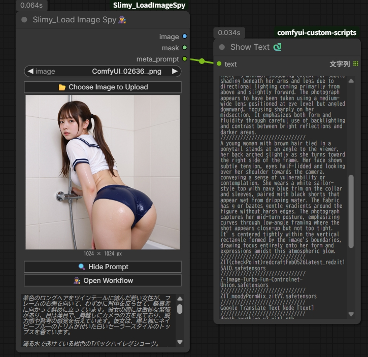

# Slimy_LoadImageSpy 🕵️

標準の LoadImage にメタデータ表示を追加した ComfyUI カスタムノードです。  
PNG・WebP・MP4 に埋め込まれた生成プロンプトを自動抽出してノード上に表示します。


## 機能

- 通常のImageLoaderとしても利用できます（PNG / WebP /jpg）
- PNG / WebP  の埋め込みプロンプトを抽出・表示
- **MP4**（ComfyUI 出力動画）のメタデータにも対応
- ワークフローが埋め込まれている場合は「Load Workflow」ボタンで即ロード
- プロンプトがなければ「No Metadata」と表示
- 出力: `IMAGE` / `MASK` / `meta_prompt`（STRING）

## インストール

```bash
cd ComfyUI/custom_nodes
git clone https://github.com/Slimy-Comfy/Slimy_LoadImageSpy
```

その後 ComfyUI を再起動してください。

## 使い方

1. ノード追加メニューから `Slimy` カテゴリを開く
2. **Slimy_Load Image Spy🕵️** を追加
3. 画像をアップロードすると `meta_prompt` ウィジェットにプロンプトが自動表示
4. ワークフロー情報がある場合は「Load Workflow」ボタンが有効になる

## 対応フォーマット

| フォーマット | 画像読み込み | メタデータ取得 | ワークフロー取得 |
|---|---|---|---|
| PNG  | ✅ | ✅ | ✅ |
| WebP | ✅ | ✅ | ✅ |
| JPEG | ✅ | ❌ | ❌ |
| MP4  | ❌ | ✅ | ✅ |

## 動作環境

- ComfyUI（最新版推奨）
- 追加の pip インストールは不要（Pillow・numpy・torch は ComfyUI に付属）

## ライセンス

MIT
